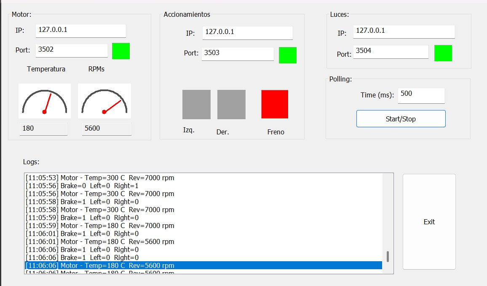
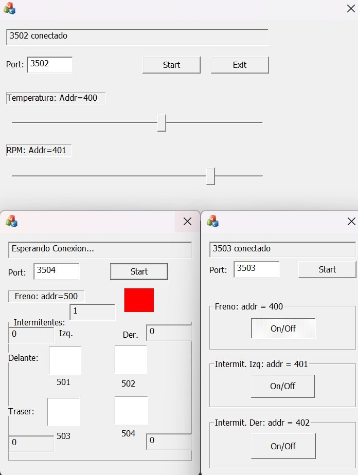

# Sistemas Telemáticos — TECNUN

Solución al proyecto final de la asignatura de Sistemas Telemáticos, hecho en MFC porque somos vintage.

Lo dejamos aquí por si a alguien le resulta útil.

El proyecto implementa un sistema de monitorización industrial basado en el protocolo **Modbus TCP/IP**, con arquitectura maestro-esclavo. Un maestro (la centralita) se comunica con tres esclavos que simulan subsistemas reales de un coche (creo): motor, accionamientos y luces.

## Arquitectura

```
Centralita (Master) → (puerto 8082) → "Servidor web"
    ├── Slave - Motor          (puerto 3502) → temperatura y revoluciones
    ├── Slave - Accionamientos (puerto 3503) → freno, izquierda, derecha
    └── Slave - Luces          (puerto 3504) → salidas controladas por el maestro
```

El maestro lee registros Holding de los esclavos (temperatura, rpm, estado de frenos...), procesa los datos aplicando factores de escala y puede escribir en los esclavos para controlar actuadores como las luces.

## Interfaz

La centralita muestra en tiempo real los datos de los tres esclavos: velocidad y temperatura del motor con indicadores tipo velocímetro, estado de los accionamientos (freno, izq., der.) con indicadores de color, y el log de eventos con timestamp.



Los esclavos tienen sus propias ventanas de configuración: el de motor expone sliders para simular temperatura y rpm, el de accionamientos permite toggling de freno e intermitentes, y el de luces recibe escrituras del maestro.



## Estructura del repo

- `Master-centralita/` — Aplicación maestra con interfaz gráfica (MFC)
- `Slav-Motor/` — Esclavo que expone registros de temperatura y velocidad del motor
- `Slav-Accio/` — Esclavo de accionamientos (freno, dirección)
- `Slav-Light/` — Esclavo receptor de órdenes de iluminación
- `tester_server.py` — Servidor Modbus en Python para testear el maestro sin los esclavos ***OPCIONAL***

## Tecnologías

- **C/C++** — lógica principal de maestros y esclavos (~97% del código)
- **MFC (Microsoft Foundation Classes)** — para la interfaz gráfica. [Llaman de los 90s quieres su Framework de vuelta.](https://youtu.be/zZ5Yaowmm1A?si=7Z63pzitZsFZxYcr&t=78). 🥵
- **Python + pymodbus** — servidor de pruebas para simular los esclavos ***OPCIONAL***

## Web server 

La centralita incluye un servidor HTTP embebido en `localhost:8082` que sirve una página con auto-refresh cada segundo. Muestra el estado de los tres esclavos (temperatura, rpm, accionamientos y estado de conexión) con un dashboard en HTML/CSS. El dashboard se sirve mediante la sofisticada técnica de concatenar etiquetas HTML a mano dentro de un `CString`. Porque, ¿quién usaría frameworks modernos de servidor o un motor de plantillas en pleno 2026?

## Cómo probar sin los esclavo ***OPCIONAL***

Levanta los tres esclavos simulados con:

```bash
pip install pymodbus
python tester_server.py
```

Esto arranca tres servidores Modbus en localhost (puertos 3502, 3503 y 3504) con valores de prueba precargados. Después arranca el ejecutable del maestro y debería conectar sin problema.

## Nota

Proyecto académico. El código cumple su función, que era aprobar (espero). 

Cuidado con los offsets de registros Modbus (pymodbus tiene un desplazamiento +1 que da más de un dolor de cabeza).

---

Licencia MIT — haz lo que quieras con esto.
